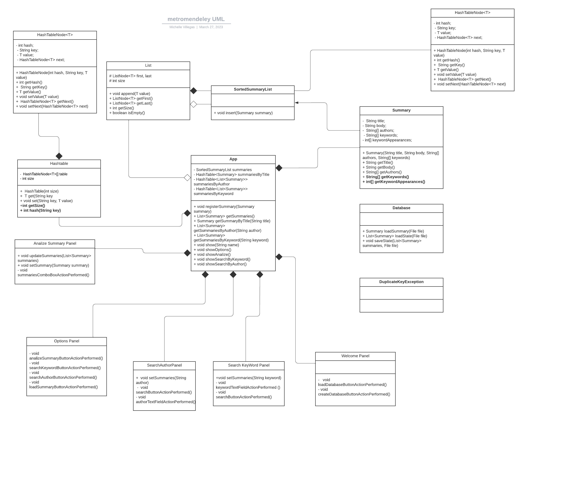

# METRO MENDELEY

Segundo proyecto de Estructuras de Datos. Trimestre 2223-2.

## Características

* Implementación de una Hash Table con claves de tipo String.

* Operaciones de búsqueda de resúmenes por título, autor y palabras clave.

* Carga de resúmenes individuales, junto a un archivo de memoria que guarda toda la librería de resúmenes cargados.

* Inserción y búsqueda de elementos con complejidad promedio de O(1).

## Autores

* Andres Goncalves
* Michelle Villegas

## Diagrama de Clases UML

